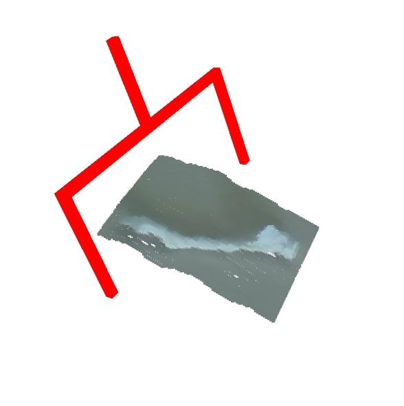
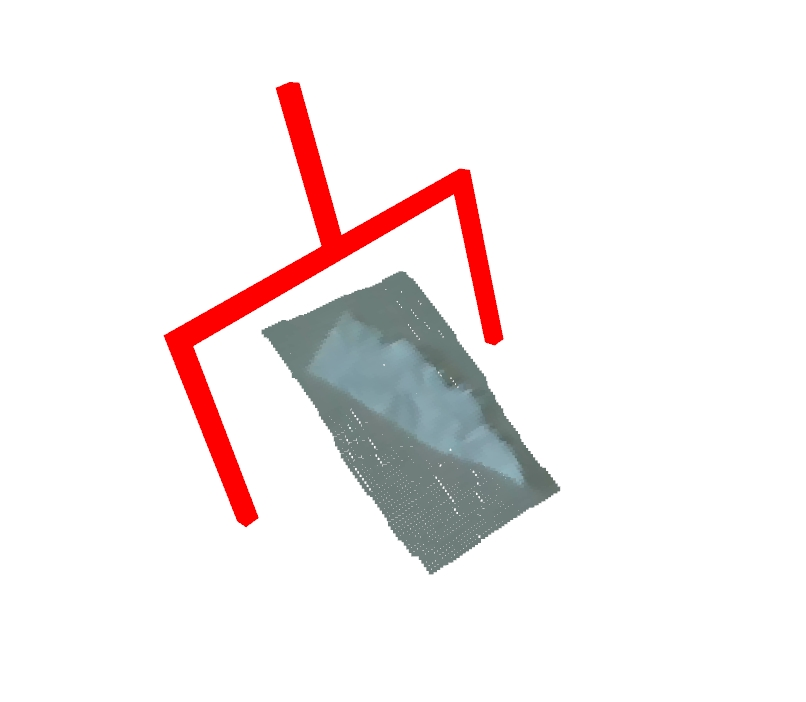
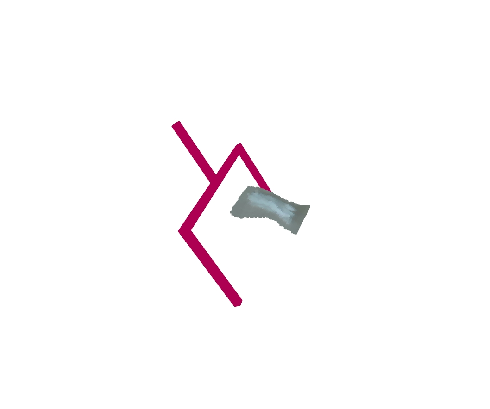
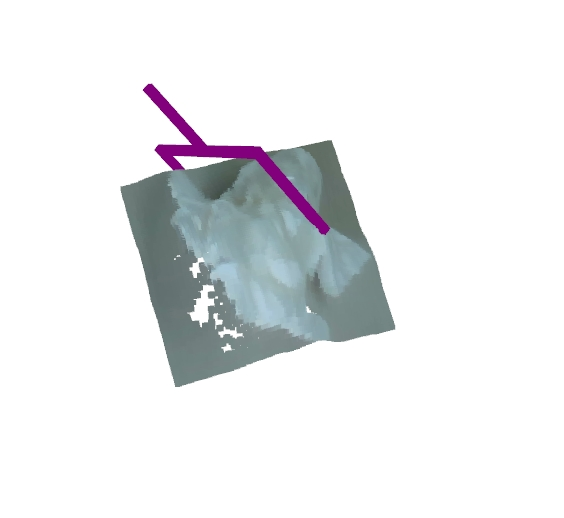
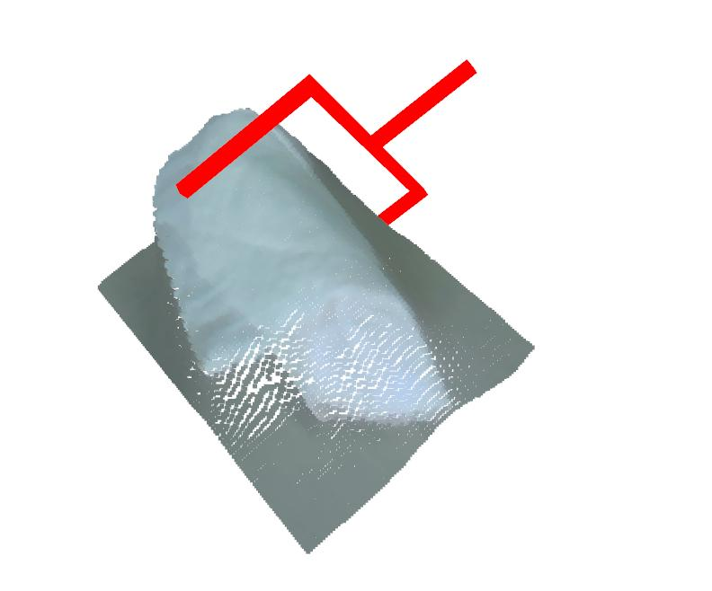
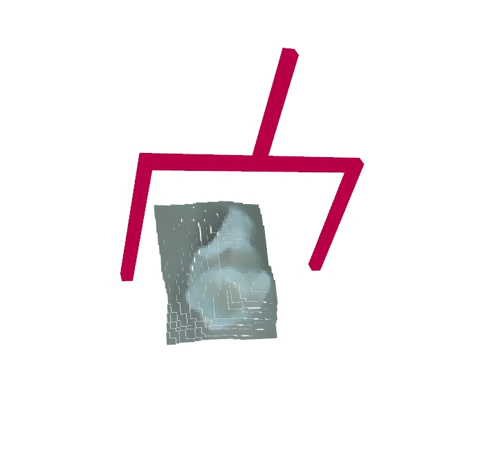
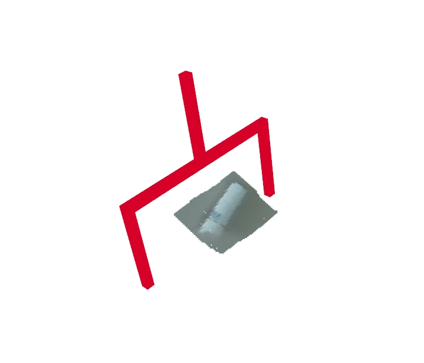

# 🤖 GraspNet-based-on-YOLO-for-specific-object-recognition-and-grasp

A small research project that connects **YOLOv8**, **GraspNet baseline** and a **Flexiv robot** for stain / object–aware grasping on a tabletop.

---

## ✨ What it does

- 🧠 **YOLOv8** detects target stains / objects on RGB images and generates a workspace mask.
- 📷 **RealSense RGB‑D** provides depth, used to build a masked point cloud.
- ✋ **GraspNet** predicts 6‑DoF grasp poses on the masked point cloud.
- 🦾 **Flexiv** executes the selected grasp (approach → close gripper → lift → place).

---

## 📂 Key files

- `grasp_out_api.py` – main end‑to‑end demo (YOLO + GraspNet + Flexiv).
- `robot-stain-perception/tools/grasp_mask_api.py` – YOLO + depth → mask.
- `robot-stain-perception/tools/realsense_api.py` – RealSense wrapper (frames + intrinsics).
- `FlexivRobot.py` & `trajectory_planner.py` – robot control helpers.
- `pointnet2/` – PointNet++ CUDA ops for GraspNet.

---

## ⚙️ Setup (minimal)

```bash
conda create -n flexiv python=3.10 -y
conda activate flexiv

# Example (CUDA 11.7, adjust if needed)
pip install torch==1.13.1 torchvision==0.14.1 torchaudio==0.13.1 \
  --index-url https://download.pytorch.org/whl/cu117

pip install opencv-python pyrealsense2 open3d pyyaml tqdm ultralytics flexivrdk

cd pointnet2 && python setup.py install && cd ..
```

Place your models:

- 🧠 YOLO weights, e.g. `yolo8l_batch8_run1.pt` in the repo root.
- ✋ GraspNet checkpoint in `checkpoints/`, e.g. `checkpoints/checkpoint-rs.tar`.

---

## ▶️ Run the demo

> ⚠️ Make sure the Flexiv robot is in a safe and clear workspace.

```bash
conda activate flexiv
python grasp_out_api.py
```

The script will:
1. Capture RGB‑D from RealSense.
2. Detect stains / objects and save a binary mask in `generated_masks/`.
3. Predict grasp poses with GraspNet.
4. Ask for confirmation and command the Flexiv arm to execute the grasp.

---

## 📸 Qualitative Results on Toilet Trash

| 垃圾类别                   | GraspNet 预测抓取示例                     |
|---------------------------|------------------------------------------|
| 细小纸巾                  |   |
| 薄层纸巾（2.5 cm 左右）   |  |
| 薄层纸巾（1.0 cm 左右）   |  |
| 成团纸巾                  |     |
| 大块纸巾（4 张）          |  |
| 湿掉的纸巾                |       |
| 单张纸巾                  | |
| 卫生巾（成团）            |  |
| 湿巾                      |        |
| 烟头                      |  |

## 🙏 Acknowledgements

This repo builds on:

- GraspNet Baseline
- YOLOv8 by Ultralytics
- Flexiv RDK
- Intel RealSense SDK
